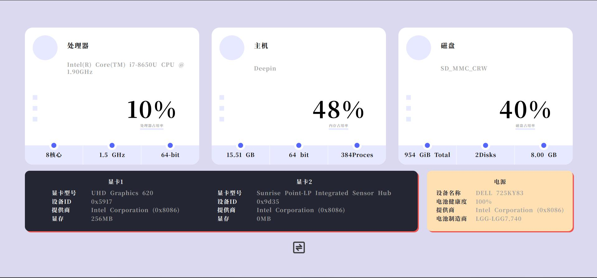
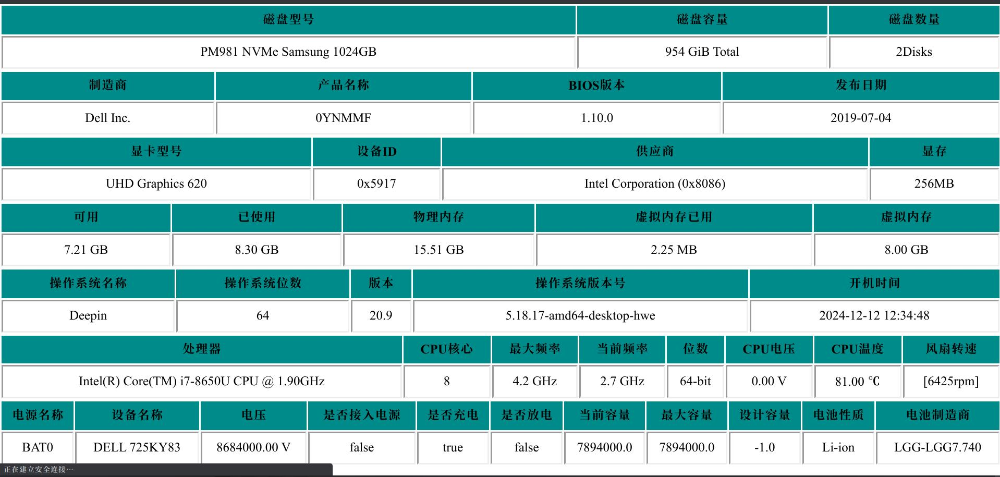
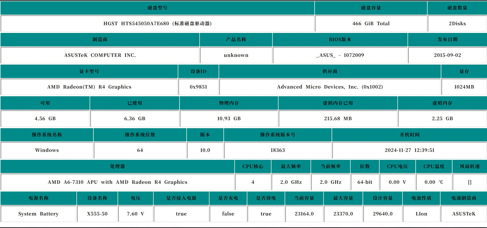

# Web-Htop
#### About 关于

Web-Htop是一个简单的服务器系统监控工具，以网页的形式显示系统运行状态。前端使用Vue构建，后端使用SpringBoot构建。该项目源于https://github.com/Rudolf-Barbu/Ward .

Web Htop is a simple server system monitoring tool that displays system operation status in the form of web pages. This project originates from https://github.com/Rudolf-Barbu/Ward .

#### Documentation 文档

- [OSHI模块](https://github.com/oshi/oshi)的API获取硬件信息
- [OSHI文档](https://www.oshi.ooo/oshi-core-java11/apidocs/com.github.oshi/module-summary.html)
- [OSHI模块](https://github.com/oshi/oshi)提供了一套跨平台检索系统信息的API

#### ScreenShot 截图

###### Linux 

###### Windows

#### Thanks 致谢

- [Ward](https://github.com/Rudolf-Barbu/Ward)
- [Oshi](https://github.com/oshi/oshi)
- [Web-Htop-fronted](https://github.com/OldSaltFish/Web-Htop-fronted)
