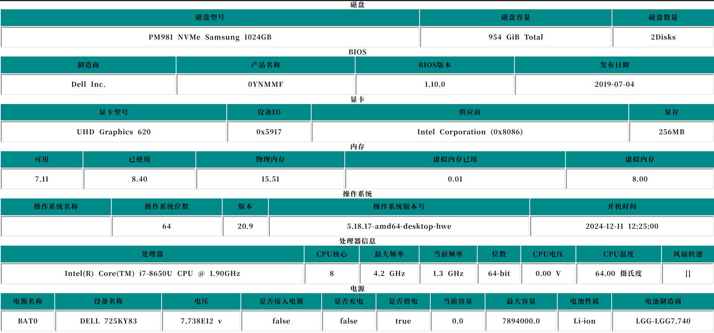

# Web-Htop
##### About 关于

Web-Htop是一个简单的服务器系统监控工具，以网页的形式显示系统运行状态。该项目源于https://github.com/Rudolf-Barbu/Ward .

Web Htop is a simple server system monitoring tool that displays system operation status in the form of web pages. This project originates from https://github.com/Rudolf-Barbu/Ward .

##### ScreenShot 截图

Thanks 致谢

- [Ward](https://github.com/Rudolf-Barbu/Ward)

- [Oshi](https://github.com/oshi/oshi)
